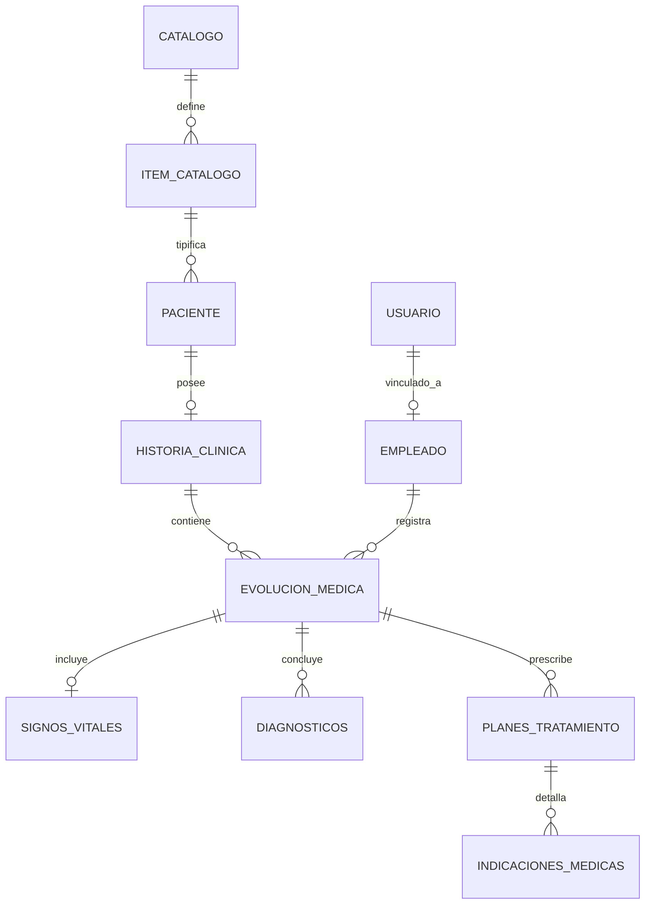

# Documentación de Base de Datos  
## Sistema de Gestión de Historias Clínicas

Este repositorio centraliza la arquitectura, el diseño lógico y los scripts de implementación de la base de datos para el **Centro Médico Urdiales-Espinoza** (Ambato, Ecuador).  
El diseño ha sido optimizado para garantizar la integridad de los datos clínicos y la seguridad de la información sensible de los pacientes.

---

## Resumen del Proyecto

La base de datos soporta un sistema web integral para la gestión de expedientes médicos electrónicos.  
Su arquitectura está normalizada para permitir un seguimiento detallado del historial clínico del paciente, desde los antecedentes médicos hasta el cierre de cada evolución clínica.

---

## Especificaciones Técnicas

- **Motor de base de datos:** PostgreSQL 16+  
- **Identificadores:** UUID v4, utilizados para mitigar riesgos de enumeración de recursos y facilitar la escalabilidad del sistema.  
- **Auditoría:** Todas las entidades incluyen los campos `fecha_creacion` y `fecha_actualizacion`, gestionados automáticamente mediante listeners de persistencia.  
- **Codificación:** UTF-8 para soporte completo de caracteres especiales en diagnósticos, observaciones y textos clínicos.

---

## Arquitectura por Módulos

El esquema de base de datos se organiza en módulos lógicos que facilitan el mantenimiento, la escalabilidad y la seguridad.

### 1. Seguridad y Autenticación (Auth)

Gestiona el acceso de los profesionales de la salud al sistema.

- **Tablas:** `usuarios`, `roles`, `refresh_tokens`, `usuario_rol`  
- **Seguridad:** Almacenamiento de contraseñas mediante hash y gestión de sesiones utilizando tokens de refresco.

### 2. Catálogos Maestros (Catalogos)

Estructura dinámica que permite parametrizar el sistema sin modificar el esquema físico.

- **Tablas:** `catalogos`, `items_catalogo`  
- **Uso:** Estandarización de géneros, provincias, patologías CIE-10, tipos de sangre, entre otros.

### 3. Gestión de Personal (Empleados)

Registro de los profesionales de la salud y del personal administrativo.

- **Tablas:** `empleados`  
- **Relación:** Vinculación directa con el módulo de seguridad para identificar al responsable de cada evolución médica.

### 4. Módulo de Pacientes (Pacientes)

Gestión integral de la información del sujeto de atención.

- **Tablas:**  
  - `pacientes`  
  - `pacientes_datos_demograficos`  
  - `pacientes_ubicacion_geografica`  
  - `pacientes_antecedentes_clinicos`  
  - `pacientes_contacto_emergencia`  

- **Estructura:**  
  - Relaciones 1:1 para datos demográficos y ubicación.  
  - Relaciones 1:N para antecedentes clínicos y contactos de emergencia.

### 5. Historia Clínica y Evoluciones Médicas

Núcleo clínico del sistema, alineado con estándares de salud pública.

- **Tablas:**  
  - `historias_clinicas`  
  - `evoluciones_medicas`  
  - `evolucion_signos_vitales`  
  - `evolucion_diagnosticos`  
  - `evolucion_planes_tratamiento`  
  - `evolucion_alta_medica`  

- **Características:**  
  - Registro de signos vitales con cálculo automático de IMC.  
  - Diagnósticos codificados bajo estándar CIE.  
  - Prescripciones detalladas y soporte para protocolos clínicos especializados.

---

## Diagrama Lógico (ERD)

La siguiente definición representa las relaciones principales entre las entidades del sistema:



---

## Estructura del Repositorio

```
/database-documentation
│
├── /diagrams            # Diagramas ERD en formato imagen y fuente (Mermaid)
├── /scripts             # Scripts SQL organizados por prioridad
│   ├── 01-schema.sql    # DDL: Creación de tablas, constraints e índices
│   └── 02-data.sql      # DML: Roles base, catálogos iniciales y usuario ADMIN
└── README.md            # Documentación técnica principal
```

---

## Guía de Implementación

### Preparación del Entorno

Asegúrese de contar con una instancia de PostgreSQL en ejecución y cree una base de datos vacía:

```sql
CREATE DATABASE gestion_clinica_db;
```

### Ejecución del Esquema

Ejecute el script `01-schema.sql`.  
Se recomienda utilizar herramientas como **pgAdmin**, **DBeaver** o la terminal **psql**.

### Carga de Datos Iniciales

Es obligatorio ejecutar el script `02-data.sql` antes de iniciar la aplicación backend, para garantizar la existencia de catálogos base y roles del sistema.

---

## Información Adicional

Este proyecto fue desarrollado como parte del trabajo de tesis:

**Sistema Web de Gestión de Historias Clínicas**

---

## Autor

**Jhonny Villanueva**  
Repositorio GitHub: https://github.com/jmvillanueva-dev